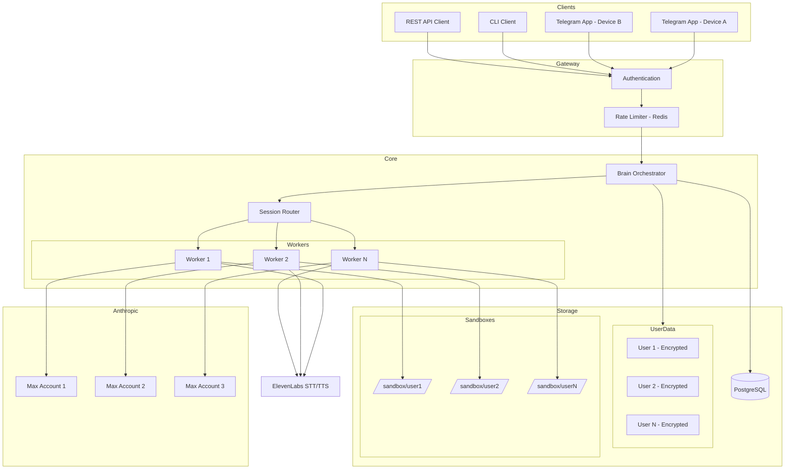
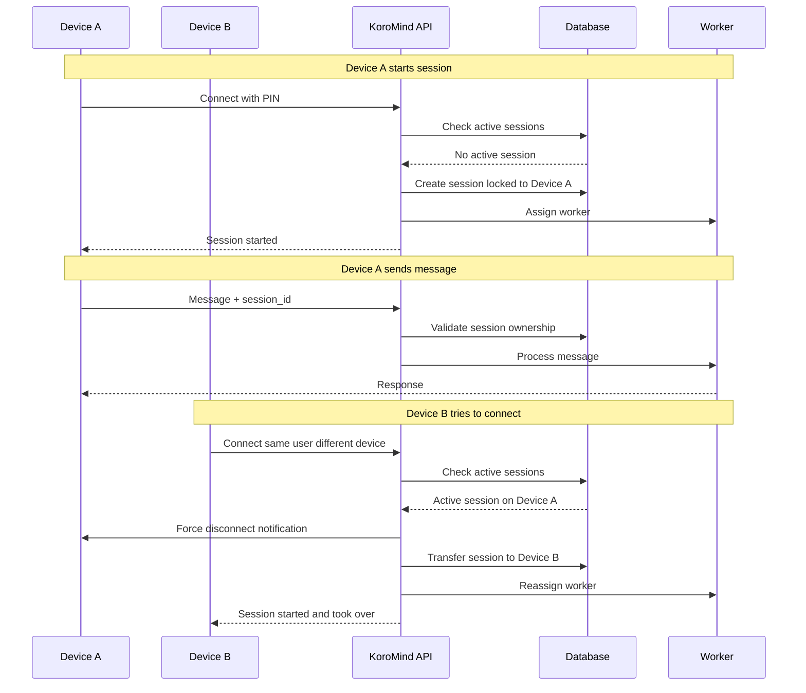
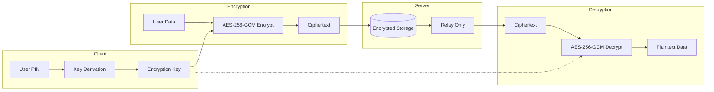
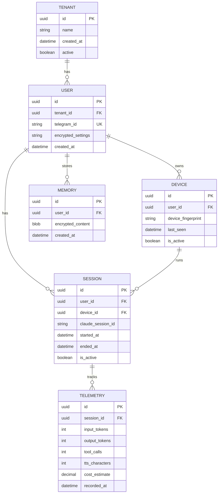
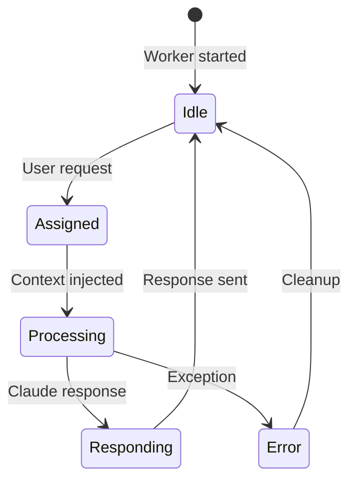
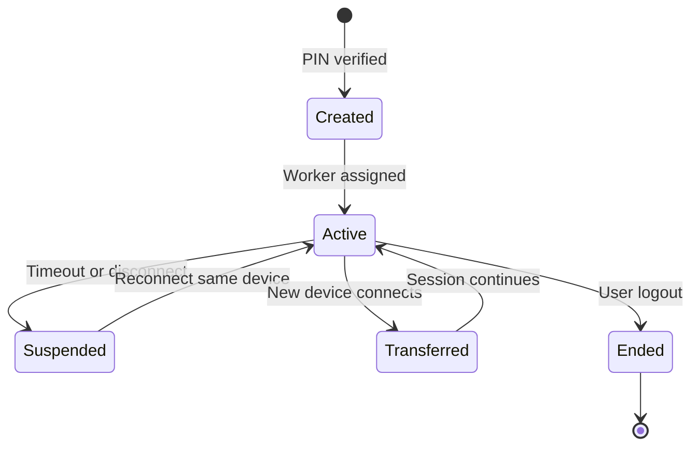

# Multi-Tenancy Architecture

## Goal
- Transform KoroMind from single-user to multi-tenant
- Zero-knowledge encryption for user data privacy
- Scale to 1000+ users with worker pool architecture

## Architecture Decisions
- Pre-warmed worker pool (no cold start)
- User PIN derives encryption key (MVP)
- Session locked to one device at a time
- Force-close old session when new device connects
- Anthropic API key rotation across Max accounts

## System Overview

## Session & Device Locking

Sessions are locked to one device at a time. When a new device connects, the old session is force-closed.

## Zero-Knowledge Encryption

Server never sees plaintext user data. PIN-derived key encrypts on client, server is relay only.

## Data Model

## Worker Lifecycle

## Session Lifecycle

## Readiness Score: 1.5/10

| Category | Score | Blocker |
|----------|-------|---------|
| Data Isolation | 1/10 | Shared database, sandbox |
| Security | 2/10 | Session hijacking, plaintext |
| Scalability | 2/10 | SQLite, in-memory state |
| Token Tracking | 0/10 | Not implemented |
| Encryption | 0/10 | No zero-knowledge |

## Dependencies
- SEC-001: Session hijacking fix
- SEC-002: Per-user sandbox
- FEAT-001: Token tracking
- BUG-001, BUG-002: Race conditions

## Estimate
8-12 weeks for production-ready multi-tenancy
