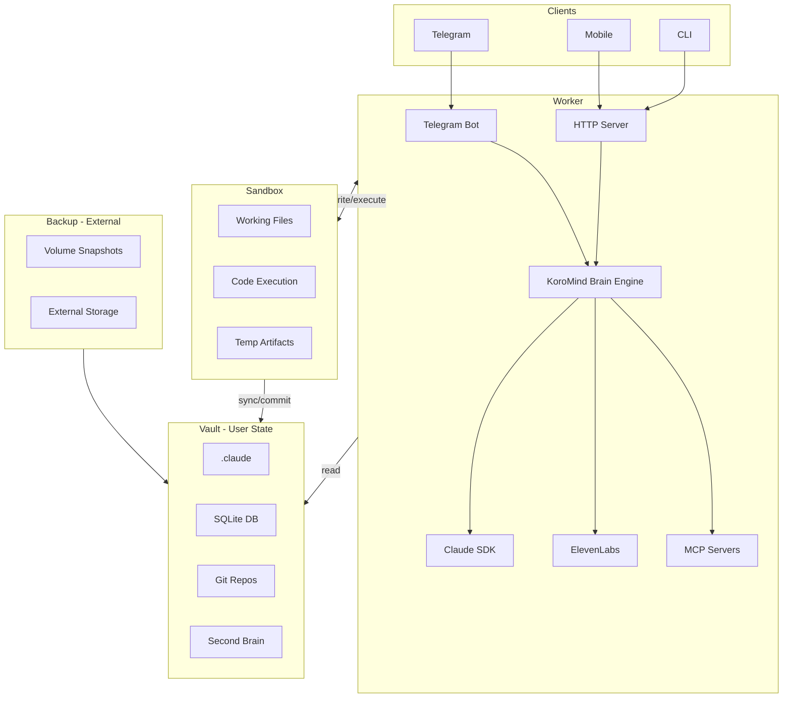

# KoroMind Architecture V1 Proposal

## Overview

This document describes the single-instance deployment architecture for KoroMind. It separates concerns into four main components: Worker, Sandbox, Vault, and Backup.

## Diagram

## Components

### Worker

The runtime container that processes user requests. Contains:

- **Telegram Bot** - Handles Telegram messages
- **HTTP Server** - REST API for Mobile and CLI clients
- **Brain Engine** - Core orchestration logic
- **Claude SDK** - Agentic capabilities
- **ElevenLabs** - Text-to-speech and speech-to-text
- **MCP Servers** - External tool integrations

### Sandbox

Ephemeral workspace where Claude executes code and creates files. This is the scratch area.

- **Working Files** - Files Claude is actively working on
- **Code Execution** - Where scripts run
- **Temp Artifacts** - Build outputs, temporary data

The Sandbox can be wiped without losing user data.

### Vault

Persistent user state. Everything the user owns lives here.

- **.claude** - Settings, skills, tool configurations
- **SQLite DB** - Memories, sessions, conversation history
- **Git Repos** - User's code repositories with CLAUDE.md files
- **Second Brain** - Notes, ideas, personal knowledge base

On Worker startup, it hydrates from the Vault.

### Backup

External system that snapshots the Vault. Managed outside KoroMind (VPS scripts, cloud storage, etc.).

## Data Flow

1. **Client → Worker**: User sends message via Telegram, Mobile, or CLI
2. **Worker ↔ Sandbox**: Worker reads/writes/executes in Sandbox freely
3. **Worker → Vault**: Worker reads user state (read-only during operation)
4. **Sandbox → Vault**: Changes sync/commit from Sandbox to Vault when ready
5. **Vault → Backup**: External system snapshots Vault periodically

## Design Decisions

- **Worker only writes to Sandbox** - Prevents accidental corruption of user state
- **Sync gate between Sandbox and Vault** - Changes are staged before persisting
- **Vault is portable** - Can be mounted to any Worker instance
- **Backup is external** - Keeps the core system simple
