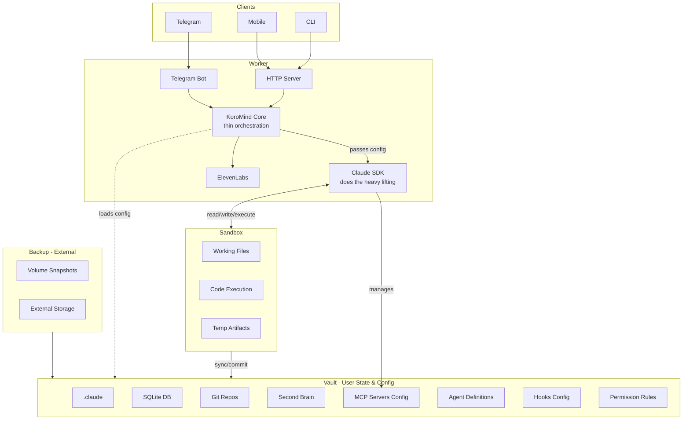
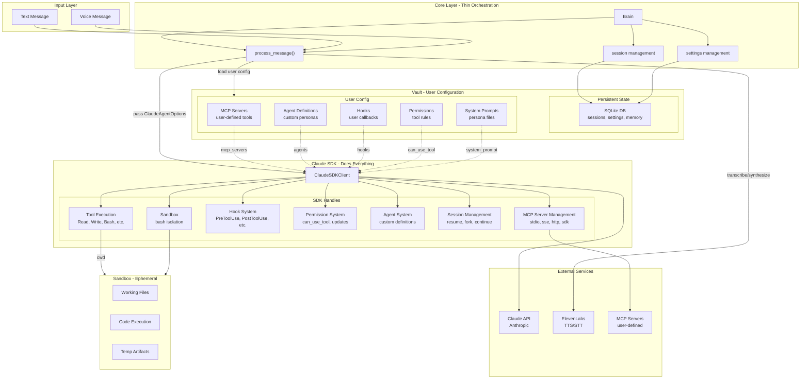

# KoroMind Architecture V1 Proposal

## Overview

This document describes the single-instance deployment architecture for KoroMind. It separates concerns into four main components: Worker, Sandbox, Vault, and Backup.

**Key Insight**: The Claude SDK handles most complexity (tools, MCP, hooks, permissions, sessions). KoroMind Core is a thin orchestration layer that loads user configuration from Vault and passes it to the SDK.

## System Diagram

## Core Architecture (Detailed)

## Components

### Worker

The runtime container that processes user requests. Contains:

- **Telegram Bot** - Handles Telegram messages
- **HTTP Server** - REST API for Mobile and CLI clients
- **KoroMind Core** - Thin orchestration layer
- **Claude SDK** - Does the heavy lifting (tools, MCP, hooks, permissions)
- **ElevenLabs** - Text-to-speech and speech-to-text

### KoroMind Core (Brain)

Thin orchestration layer. Its job is simple:

1. Receive input (text/voice)
2. Transcribe voice if needed (ElevenLabs)
3. Load user configuration from Vault
4. Build `ClaudeAgentOptions` and pass to SDK
5. Handle response (synthesize audio if needed)
6. Update session state

**Core does NOT**:
- Manage MCP servers (SDK does this)
- Handle tool permissions (SDK does this)
- Execute tools (SDK does this)
- Manage hooks (SDK does this)

### Claude SDK

The Claude Agent SDK handles all the complexity:

| Capability | Description |
|------------|-------------|
| **Tool Execution** | Read, Write, Edit, Bash, Grep, Glob, etc. |
| **MCP Servers** | stdio, sse, http, and in-process sdk servers |
| **Hook System** | PreToolUse, PostToolUse, UserPromptSubmit, Stop, SubagentStop, PreCompact |
| **Permission System** | can_use_tool callback, PermissionUpdate, dynamic rules |
| **Agent System** | Custom agent definitions with own prompts/tools/models |
| **Session Management** | resume, fork, continue_conversation |
| **Sandbox** | Bash isolation, network controls |
| **Structured Output** | JSON schema validation |
| **File Checkpointing** | Track and rewind file changes |

### Sandbox

Ephemeral workspace where Claude executes code and creates files. This is the scratch area.

- **Working Files** - Files Claude is actively working on
- **Code Execution** - Where scripts run
- **Temp Artifacts** - Build outputs, temporary data

The Sandbox can be wiped without losing user data.

### Vault

Persistent user state AND configuration. Everything the user owns lives here.

**State**:
- **SQLite DB** - Sessions, settings, memory, conversation history

**Configuration** (passed to Claude SDK):
- **MCP Servers** - User-defined tool servers
- **Agent Definitions** - Custom personas with own prompts/tools
- **Hooks** - User callbacks for tool interception
- **Permission Rules** - Tool allow/deny rules
- **System Prompts** - Persona markdown files

**Other**:
- **.claude** - Claude Code settings
- **Git Repos** - User's code repositories
- **Second Brain** - Notes, ideas, personal knowledge base

On Worker startup, it hydrates from the Vault.

### Backup

External system that snapshots the Vault. Managed outside KoroMind (VPS scripts, cloud storage, etc.).

## Data Flow

1. **Client → Worker**: User sends message via Telegram, Mobile, or CLI
2. **Worker → Vault**: Core loads user configuration (MCP, agents, hooks, permissions)
3. **Worker → SDK**: Core passes `ClaudeAgentOptions` with all user config
4. **SDK ↔ Sandbox**: SDK reads/writes/executes in Sandbox freely
5. **SDK → MCP**: SDK manages user's MCP servers
6. **Sandbox → Vault**: Changes sync/commit from Sandbox to Vault when ready
7. **Vault → Backup**: External system snapshots Vault periodically

## Design Decisions

- **Core is thin** - Just orchestration, SDK does the work
- **MCP config lives in Vault** - User owns their tool configurations
- **SDK handles permissions** - Use can_use_tool callback, not custom logic
- **Vault holds all user config** - Portable, can mount to any Worker
- **Sandbox is ephemeral** - Can be wiped without losing user data
- **Backup is external** - Keeps the core system simple

## ClaudeAgentOptions Mapping

How Vault config maps to SDK options:

| Vault | ClaudeAgentOptions |
|-------|-------------------|
| MCP Servers | `mcp_servers` |
| Agent Definitions | `agents` |
| Hooks | `hooks` |
| Permission Rules | `can_use_tool` / `allowed_tools` |
| System Prompts | `system_prompt` |
| Sandbox Config | `sandbox` |
| Session ID | `resume` / `continue_conversation` |

## Future: Direct Vault Writes

Currently, agents can only write to Sandbox. Future enhancement:
- Agents can write directly to Vault with approval
- Use SDK's `can_use_tool` to gate Vault writes
- Sync gate still exists for unapproved changes
