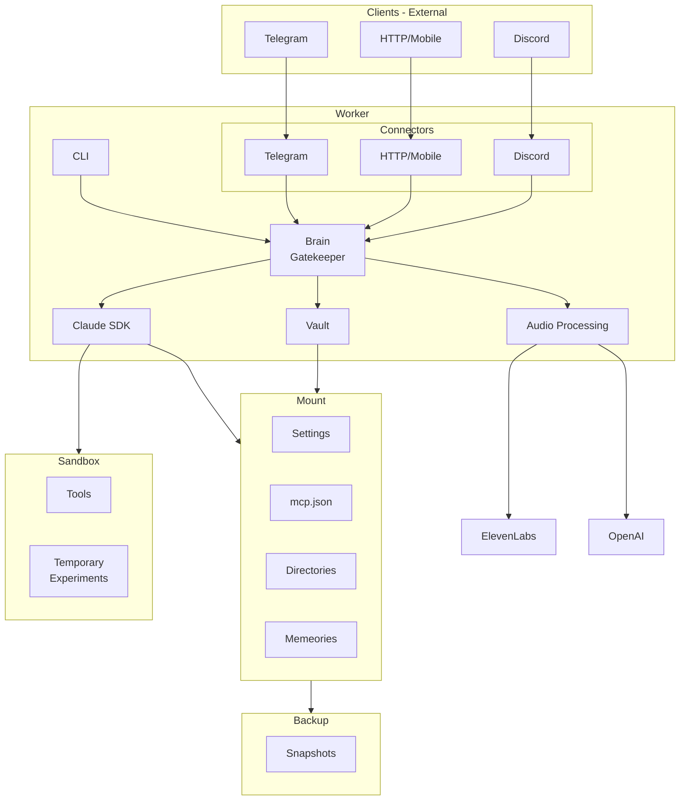

# KoroMind Single-Instance Architecture

## System Overview



## Components

| Component | Role |
|-----------|------|
| **Connectors** | Protocol adapters translating external clients to internal format |
| **CLI** | Direct command-line interface to Brain |
| **Brain (Gatekeeper)** | Central orchestrator—loads config, calls SDK, handles voice, manages all component communication |
| **Vault** | In-worker state manager, bridges Brain to Mount |
| **Audio Processing** | ElevenLabs/OpenAI STT/TTS |
| **Claude SDK** | Tool execution, MCP, permissions, sessions, Mount access |
| **Mount** | Persistent user state and config (Docker volume mount) |
| **Sandbox** | Ephemeral workspace for Claude (Docker volume) |

---

## Design Decisions

### Decision 1: Unified Protocol

**Problem discovered**: Connectors were inconsistent.

| Connector | What it was doing |
|-----------|-------------------|
| HTTP API | `routes/messages.py` → `Brain.process_message()` ✓ |
| Telegram | `handlers/messages.py` → `get_claude_client()` directly ✗ |

Telegram was bypassing Brain entirely—calling Claude SDK directly, managing its own `pending_approvals`, implementing its own `can_use_tool` callback, its own watch mode. Business logic duplicated, behavior inconsistent, hard to add new connectors.

**Decision**: One protocol. All connectors speak it. API routes to Brain, Brain handles everything.

```
Connector → JSON Request → API → Brain → SDK
                            ↓
Connector ← JSON Response ← API
```

**Value**: Single source of truth. Add Discord? Just translate its messages to JSON. Same logic, same behavior.

---

### Decision 2: Thin Connectors

**Pattern**: Connectors only translate. They don't think.

Connector responsibilities:
1. Receive native input (Telegram update, HTTP request)
2. Translate to JSON
3. Send to API
4. Receive JSON response
5. Translate to native output

Connectors do NOT:
- Call Brain directly
- Call Claude SDK
- Manage sessions
- Store state
- Implement approval logic

**Value**: No duplication. Test API and Brain once, not each connector separately.

---

### Decision 3: Brain is Thin

**Insight**: The Claude SDK already solves the hard problems—tool execution, MCP server management, hooks, permissions, session continuity.

Brain's job:
1. Receive input from API
2. Transcribe voice if needed
3. Load user config from Vault
4. Build `ClaudeAgentOptions`, pass to SDK
5. Synthesize audio if needed
6. Update state

Brain does NOT:
- Execute tools (SDK does)
- Manage MCP servers (SDK does)
- Handle permissions (SDK does)
- Manage hooks (SDK does)

**Value**: We don't reinvent what the SDK already does well. Less code, fewer bugs.

---

### Decision 4: Callbacks for Interactive Features

**Problem**: Some connectors support interactive UI (Telegram inline buttons), some don't (HTTP).

**Pattern**: Connectors register callbacks. If callback is `None`, feature is disabled.

```python
callbacks = WorkerCallbacks(
    on_tool_approval=lambda req: show_telegram_approval_ui(req),  # Telegram has this
    on_tool_use=lambda notif: send_notification(notif),           # Watch mode
    on_progress=lambda msg: update_status(msg),                   # Progress
)
```

HTTP doesn't register callbacks → approve mode doesn't work → that's fine, it's an API.

**Value**: Graceful degradation. Features work where they make sense, silently disabled elsewhere.

---

### Decision 5: Mount Holds Config

User configuration (MCP servers, agents, hooks, permissions, settings, memories) lives in Mount, not code.

Mount contains:
- **Settings** - User preferences and configuration
- **mcp.json** - MCP server definitions
- **Directories** - User data directories (git repos, notes)
- **Memories** - Long-term memory storage

On startup, Vault loads config from Mount and passes it to SDK:

| Mount | `ClaudeAgentOptions` |
|-------|---------------------|
| mcp.json | `mcp_servers` |
| Settings | `agents`, `hooks` |
| Directories | workspace paths |
| Memories | context for prompts |

**Value**:
- Portable—mount to any Worker
- User-owned—no vendor lock-in
- SDK-native—no translation layer

---

### Decision 6: Sandbox vs Mount Access

Claude has two places to work:

**Sandbox** (ephemeral):
- Working files, temp artifacts
- Code execution
- Can be wiped without data loss

**Mount** (persistent):
- SDK reads config (MCP, agents, hooks)
- SDK can write user data (git repos, notes)
- Protected from accidental wipes

Sandbox is the default scratchpad. Mount access is for intentional, persistent changes.

**Value**: Safety with flexibility. Temp work in Sandbox, important work in Mount.

---

### Decision 7: Worker is Stateless

**Security concern**: If Worker holds user data, it becomes a target. Compromise Worker, leak data.

**Pattern**: Worker holds nothing persistent. All state lives in Mount.

- No credentials stored in Worker
- No conversation history in Worker memory
- No user config baked into Worker image
- Worker can be killed and replaced without data loss
- Vault is an in-memory bridge, not persistent storage

**Value**:
- **Portability**: Mount to any Worker, instantly working
- **Security**: Worker compromise doesn't leak persistent data
- **Simplicity**: No sync, no migration, no "where's my data?"

Everything belongs to the user, stored in their Mount.

---

### Decision 8: Single Worker (for now)

Multi-tenancy is on the roadmap, but this architecture is for one user.

No tenant isolation, no credential rotation, no distributed state.

The architecture supports multi-tenancy later—Mount is portable, Worker is stateless. But MVP serves one user well before serving many poorly.

---

## Data Flow

```
1. Client sends message (Telegram/HTTP/Discord)
2. Connector translates to JSON, sends to Brain
3. Brain loads user config from Vault (which reads from Mount)
4. Brain passes ClaudeAgentOptions to SDK
5. SDK executes (tools run in Sandbox, can access Mount)
6. Vault updates state in Mount
7. Brain synthesizes audio if requested (via ElevenLabs/OpenAI)
8. Response flows back through Connector to Client
9. Mount snapshots to Backup periodically
```

---

## Changelog

- **2026-01-31**: Updated architecture - Vault moved inside Worker, Mount as persistent storage, explicit Connectors
- **2026-01-29**: Initial architecture document from V design sessions
